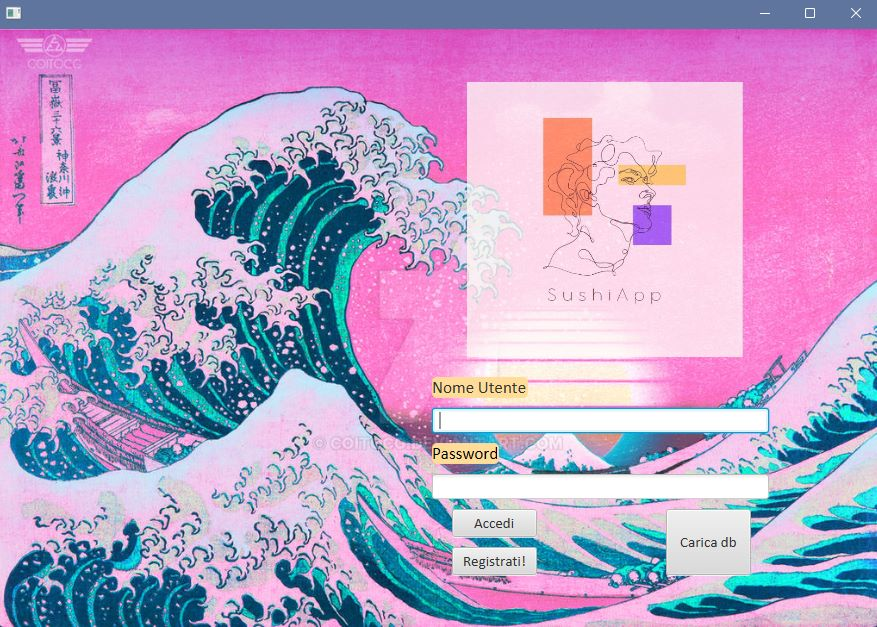
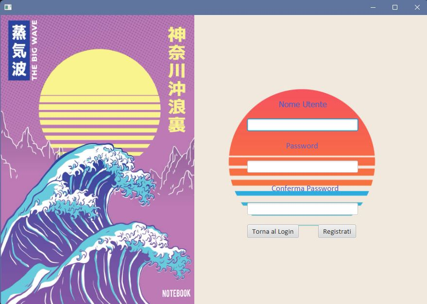
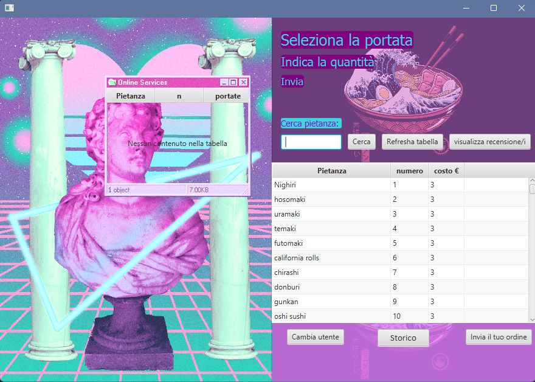

# SushiApp 🍣

**SushiApp** è un'applicazione desktop completa per ordinare sushi, sviluppata in **Java** con **Spring** e **JavaFX** e basata sullo stile grafico **VaporWave**. Questo progetto si compone di due parti distinte: un server backend e un client desktop. Grazie a questa architettura, **SushiApp** gestisce utenti, ordini, recensioni e molto altro.

## Progetto e Tecnologie

- **Spring Framework**: utilizziamo Spring per la gestione della logica di backend, implementando i vari servizi REST per la gestione degli ordini, dell'autenticazione e dei dati relativi al menu.
- **JavaFX**: usato per l'interfaccia utente del client, con uno stile grafico ispirato al VaporWave per garantire un’esperienza visiva unica e immersiva.
- **Architettura Client-Server**: il progetto è suddiviso in due progetti principali:
  - **Server**: implementato in Spring, gestisce le richieste degli utenti, archivia i dati nel database e garantisce la sicurezza e la coerenza del sistema.
  - **Client**: sviluppato in JavaFX, offre un'interfaccia utente fluida e coinvolgente per navigare e ordinare in modo intuitivo.

---

## Interfacce Principali

### Sign In

**Sign In** è la schermata iniziale di accesso in cui gli utenti possono autenticarsi inserendo nome utente e password. L’autenticazione sicura viene gestita dal server attraverso Spring Security per proteggere i dati degli utenti.

### Sign On

La schermata di **Sign On** permette ai nuovi utenti di registrarsi. Viene richiesto l'inserimento di dati essenziali per creare un account e accedere all'applicazione. La registrazione è integrata con il backend per garantire che i dati siano memorizzati in modo sicuro.

### Menu

**Menu** è il cuore dell’app, dove vengono visualizzate tutte le opzioni di sushi disponibili. Gli utenti possono selezionare gli elementi, visualizzare i dettagli e aggiungere articoli al carrello. La selezione e il caricamento dei dati del menu sono gestiti dal server, consentendo aggiornamenti dinamici.

### Recensione

Nella sezione **Recensione**, gli utenti possono lasciare un feedback sugli ordini effettuati. Il sistema di recensioni è integrato con il backend per salvare le opinioni e visualizzarle a tutti gli utenti, creando una community basata sulle esperienze condivise.

### Resoconto Ordine

Questa schermata di **Resoconto Ordine** riepiloga tutti i dettagli dell'ordine prima della conferma. Gli utenti possono verificare quantità, prezzi e dettagli di consegna. La gestione dei dati dell’ordine in tempo reale è supportata dal backend, garantendo precisione e aggiornamenti immediati.

---

## Avvio del Progetto

### Server
Per avviare il server:
1. Clonare il repository.
2. Accedere alla cartella del progetto server con `cd SushiApp-server`.
3. Configurare il database e le credenziali nel file `application.properties`.
4. Eseguire `./mvnw spring-boot:run` per avviare il server.

### Client
Per avviare il client:
1. Accedere alla cartella del progetto client con `cd SushiApp-client`.
2. Eseguire l'applicazione JavaFX tramite IDE o `./mvnw javafx:run`.

---

## Struttura del Repository

- **SushiApp-server/**: contiene il progetto Spring Boot per il server.
- **SushiApp-client/**: contiene il progetto JavaFX per il client desktop.

## Contribuisci

Siamo aperti ai contributi! Se vuoi migliorare SushiApp, segui le linee guida per i contributori e apri una pull request.

---

Con **SushiApp**, ordinare sushi diventa un'esperienza unica, elegante e funzionale, grazie a un’interfaccia in stile VaporWave e a un backend solido e sicuro.
